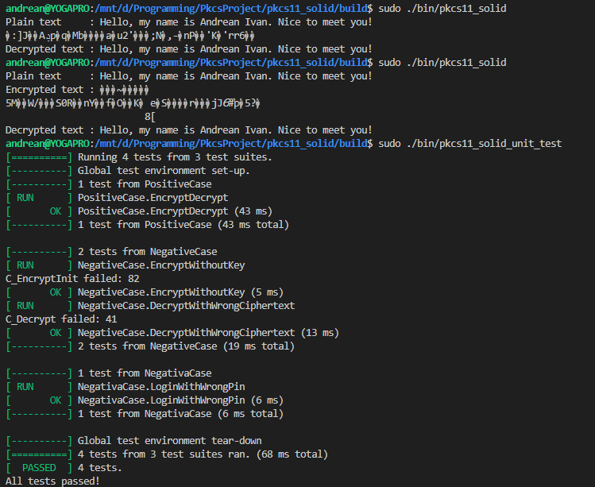

# PKCS#11 Solid Project

This project demonstrates PKCS#11 encryption and decryption using SoftHSM2 and C++, following SOLID principles. It includes unit tests and a basic encryption/decryption implementation.

## Prerequisites

- **C++17 or later compiler** (e.g., `g++`)
- **CMake** (for build system)
- **SoftHSM2** (for PKCS#11 implementation)

## Install Dependencies

On **Linux**:
```
sudo apt-get install g++ cmake libsofthsm2-dev
```

## Setup

1. **Clone the repository:**

   ```bash
   git clone https://github.com/AndreanIvan/pkcs11_solid.git
   cd pkcs11_solid
   ```

2. **Configure SoftHSM2 Token:**

   ```bash
   export SOFTHSM2_CONF=/etc/softhsm/softhsm2.conf
   softhsm2-util --init-token --slot 0 --label "MyToken" --pin 1234 --so-pin 0000
   ```

3. **Build the project:**

   ```bash
   mkdir build
   cd build
   cmake ..
   make
   ```

4. **Run the project:**

   ```bash
   ./bin/pkcs11_solid
   ```
   Please make sure that the user have `sudo` access.

5. **Run the unit test:**

   ```bash
   ./bin/pkcs11_solid_unit_test
   ```
   Please make sure that the user have `sudo` access.

## Capture of the final result



## Directory Structure

```
.
├── inc/             # Header files
├── lib/             # External libraries
├── src/             # Source files
├── test/            # Unit tests
├── CMakeLists.txt   # CMake configuration file
├── README.md        # README file
└── main.cpp         # Application entry point
```

## Troubleshooting

- **C_Initialize failed**: Ensure SoftHSM2 is installed and the `SOFTHSM2_CONF` is set correctly. I have add the object at `lib\softhsm2\libsofthsm2.so` if you still can't find one.
- **Failed to open session with PKCS#11 library**: Ensure that the binary is executed with superuser privilege.

## Change Log (based on tag)

- [`result`](https://github.com/AndreanIvan/pkcs11_solid/releases/tag/result): Project results that are delivered within the deadline.
- [`result-addition`](https://github.com/AndreanIvan/pkcs11_solid/releases/tag/result-addition): Additional works - Make the input to be more general, add unit tests
- [`result-addition-2`](https://github.com/AndreanIvan/pkcs11_solid/releases/tag/result-addition-2): Additional works 2 - Refactor the project to use more SOLID approach

## Class diagram
Below is the class diagram for this project:

